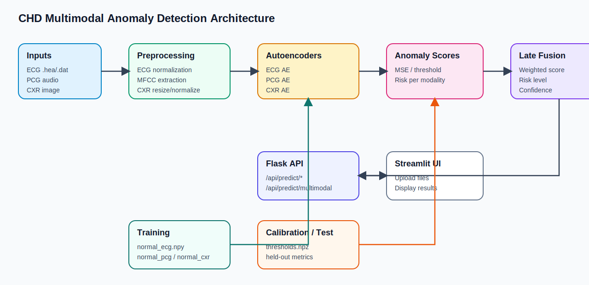
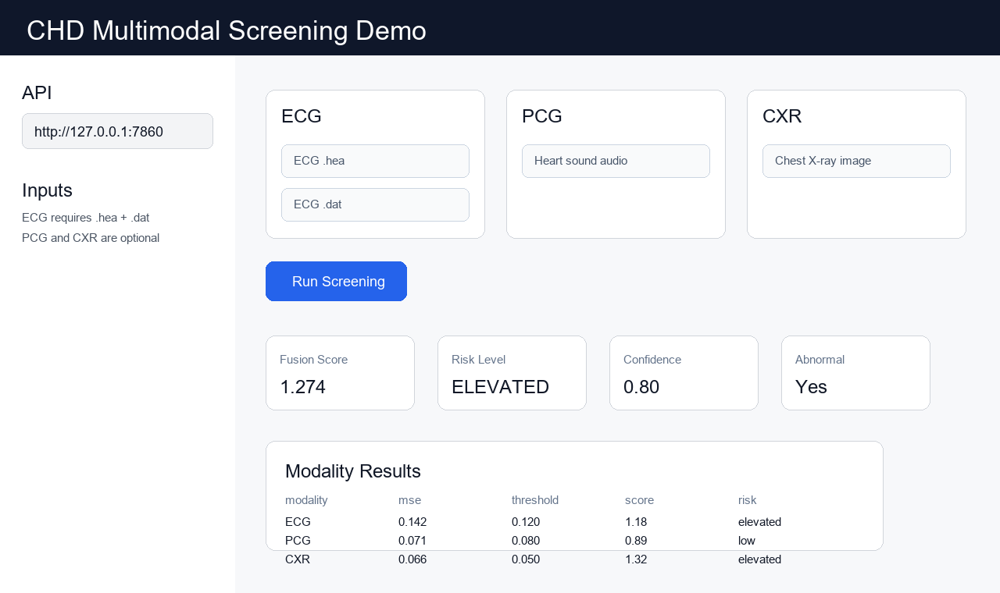

<div align="center">

# CHD 多模态异常检测

基于 ECG、PCG 与胸部 X 光片的冠心病筛查研究原型

`PyTorch` · `Flask` · `Streamlit` · `Late Fusion`

</div>

> 本项目仅用于科研、教学和工程演示，不能替代医生诊断，也不能作为医疗决策依据。

## 项目概览

系统为三种模态分别训练自编码器，只使用各自的正常样本学习重构分布。推理时以重构误差作为异常分数，再通过加权 late fusion 生成综合结果。

| 模态 | 输入 | 当前模型 | 单样本形状 |
| --- | --- | --- | --- |
| ECG | WFDB `.hea` + `.dat` | Transformer Autoencoder | `12 x 1000` |
| PCG | 心音音频 | MFCC + Transformer Autoencoder | `13 x 200` |
| CXR | 胸部 X 光图像 | ViT Encoder + CNN Decoder | `1 x 256 x 256` |

核心改进包括：

- 三个模态独立训练，不再因样本数最少的 CXR 截断 ECG 和 PCG。
- ECG/PCG 新训练模型包含 latent bottleneck，并使用 Huber loss。
- CXR 新训练模型使用完整 CNN decoder，所有反卷积层都会参与前向计算。
- 阈值仅在 calibration set 上选择，held-out test 只用于最终报告。
- API 支持缺失模态、输入覆盖度 `confidence`、统一错误码和延迟加载。
- 仓库内旧权重可兼容加载，同时明确标记其历史模型结构。

## 系统架构

[打开 draw.io 源文件](docs/architecture.drawio)



处理流程：

```text
原始数据
  -> data_preprocessing.py
  -> 每模态独立的 normal_*.npy
  -> train.py
  -> *_ae.pth
  -> optimize_thresholds.py
  -> thresholds.npz
  -> Flask API
  -> Streamlit 前端 / 命令行推理
```

## 当前权重说明

仓库中的 `ecg_ae.pth`、`pcg_ae.pth` 和 `cxr_ae.pth` 是修改模型结构之前训练的历史权重。`model.py` 会根据权重参数自动选择对应结构，因此 API 可以正常启动和推理，且不会把旧权重错误地加载进新结构。

加载后会报告以下结构名：

```text
ecg_legacy_no_bottleneck
pcg_legacy_no_bottleneck
cxr_legacy_patch_v1
```

要真正使用新增 bottleneck 和 CXR CNN decoder，必须重新运行训练与阈值校准。新训练权重会分别标记为 `ecg_bottleneck_v2`、`pcg_bottleneck_v2` 和 `cxr_cnn_decoder_v2`。

## 快速开始

### 1. 安装环境

```powershell
cd D:\chd_anomaly_detection
python -m venv .venv
.\.venv\Scripts\Activate.ps1
pip install -r requirements.txt
```

`requirements.txt` 包含训练、评估、API 和 Streamlit 前端依赖。`requirements-deploy.txt` 只包含云端 Flask API 依赖。

### 1.1 构建 RAG 临床知识库

将 CHD 相关 PDF 放到一个独立目录，建议使用英文指南、综述或规范，例如：

```text
knowledge_base/
`-- pdfs/
    |-- CHD_Clinical_Guidelines_2024.pdf
    `-- Pediatric_Cardiology_Review.pdf
```

构建知识库：

```powershell
python build_knowledge_base.py .\knowledge_base\pdfs
```

默认会把向量库持久化到 `.\chroma_db`。如果本地向量库已存在，脚本会直接加载；如果需要强制重建：

```powershell
python build_knowledge_base.py .\knowledge_base\pdfs --force-rebuild
```

首次构建时，`sentence-transformers` 会在本地下载 `all-MiniLM-L6-v2` 模型；后续会复用本地缓存，不需要额外 API。

验证检索是否正常：

```powershell
python -c "from rag_knowledge_base import init_knowledge_base, query_knowledge_base; init_knowledge_base(r'.\knowledge_base\pdfs', r'.\chroma_db'); print(query_knowledge_base('congenital heart disease echocardiography referral', top_k=2))"
```

相关环境变量：

- `CHD_KNOWLEDGE_PDF_DIR`：PDF 目录
- `CHD_KNOWLEDGE_PERSIST_DIR`：Chroma 持久化目录
- `CHD_KNOWLEDGE_COLLECTION_NAME`：向量集合名称
- `CHD_RAG_EMBEDDING_MODEL`：本地 embedding 模型，默认 `all-MiniLM-L6-v2`
- `CHD_RAG_TOP_K`：默认检索条数，默认 `3`

### 2. 启动 API

```powershell
python app.py
```

默认地址：`http://127.0.0.1:7860`

```powershell
curl.exe http://127.0.0.1:7860/api/health
curl.exe http://127.0.0.1:7860/api/version
```

模型采用延迟加载：服务启动时不会立刻读取权重，第一次预测时才加载。
RAG 知识库会在应用启动时尝试初始化。如果 `CHD_KNOWLEDGE_PDF_DIR` 不存在，API 会记录 warning，但核心检测接口仍可正常使用。

### 3. 启动前端

另开一个终端：

```powershell
cd D:\chd_anomaly_detection
.\.venv\Scripts\Activate.ps1
streamlit run streamlit_app.py
```

前端默认调用 `http://127.0.0.1:7860`，也可以在侧栏切换为已部署的 API 地址。



## 数据与训练

默认数据目录由 [config.py](config.py) 管理：

```text
data/
|-- ptbxl/                # ECG 原始数据
|-- circor/               # PCG 原始数据
|-- chd_xray/             # CXR 原始数据
|-- normal_ecg.npy        # 预处理后的正常 ECG
|-- normal_pcg.npy        # 预处理后的正常 PCG
|-- normal_cxr.npy        # 预处理后的正常 CXR
|-- ecg_data.npy          # 带标签评估数据
|-- ecg_labels.npy
|-- pcg_data.npy
|-- pcg_labels.npy
|-- cxr_data.npy
`-- cxr_labels.npy
```

路径可以用环境变量覆盖：`CHD_DATA_ROOT`、`PTBXL_PATH`、`CIRCOR_PATH`、`CHD_CXR_PATH` 和 `CHD_OUTPUT_DIR`。

```powershell
python data_preprocessing.py
python train.py
python optimize_thresholds.py
python evaluate_model.py
```

训练脚本会为 ECG、PCG 和 CXR 分别建立 `DataLoader`，每个模型使用本模态的全部正常样本。阈值优化脚本再将带标签数据分为 calibration 和 held-out test。

## 命令行推理

至少提供一个模态：

```powershell
python inference.py --ecg D:\samples\record_001
python inference.py --pcg D:\samples\heart.wav
python inference.py --cxr D:\samples\xray.png
python inference.py --pcg D:\samples\heart.wav --cxr D:\samples\xray.png
```

ECG 参数是不带 `.hea` / `.dat` 扩展名的 WFDB 记录路径。

## API 文档

| 方法 | 路径 | 用途 |
| --- | --- | --- |
| `GET` | `/` | 服务和端点概览 |
| `GET` | `/api/health` | 服务、模型加载状态 |
| `GET` | `/api/version` | API、权重与阈值版本 |
| `GET` | `/api/fusion/config` | 融合权重和风险分级 |
| `POST` | `/api/predict/ecg` | ECG 单模态预测 |
| `POST` | `/api/predict/pcg` | PCG 单模态预测 |
| `POST` | `/api/predict/cxr` | CXR 单模态预测 |
| `POST` | `/api/predict/multimodal` | 多模态预测与 late fusion |

### 多模态请求

请求类型：`multipart/form-data`

| 字段 | 内容 | 必需 |
| --- | --- | --- |
| `ecg_hea` | WFDB `.hea` 文件 | 与 `ecg_dat` 成对可选 |
| `ecg_dat` | WFDB `.dat` 文件 | 与 `ecg_hea` 成对可选 |
| `pcg_file` | `.wav` / `.mp3` / `.flac` / `.m4a` / `.ogg` | 可选 |
| `cxr_file` | `.png` / `.jpg` / `.jpeg` / `.bmp` | 可选 |

至少提交一个完整模态：

```bash
curl -X POST http://127.0.0.1:7860/api/predict/multimodal \
  -F "ecg_hea=@sample.hea" \
  -F "ecg_dat=@sample.dat" \
  -F "pcg_file=@heart.wav" \
  -F "cxr_file=@xray.jpg"
```

响应格式示例：

```json
{
  "fusion_score": 1.72,
  "fusion_risk_level": "high",
  "clinical_guidance": [
    {
      "content": "High-risk congenital heart disease screening findings should be followed by echocardiography and specialist review.",
      "source": "CHD_Clinical_Guidelines_2024.pdf"
    },
    {
      "content": "Prompt referral to pediatric cardiology is recommended when structural disease is suspected.",
      "source": "Pediatric_Cardiology_Review.pdf"
    }
  ],
  "individual_results": [
    {
      "modality": "ECG",
      "mse": 0.142,
      "threshold": 0.12,
      "score": 1.18,
      "is_abnormal": true
    }
  ],
  "fusion": {
    "available_modalities": ["ECG", "PCG", "CXR"],
    "missing_modalities": [],
    "confidence": 1.0,
    "fusion_score": 1.72,
    "risk_level": "high",
    "is_abnormal": true
  },
  "results": [
    {
      "modality": "ECG",
      "mse": 0.142,
      "threshold": 0.12,
      "score": 1.18,
      "is_abnormal": true
    }
  ]
}
```

`confidence` 表示已提供模态对应的原始权重之和，不是统计学置信度。例如只提供 ECG 和 PCG 时，`confidence = 0.8`。
当 `fusion_risk_level == "high"` 时，接口会尝试从本地 CHD PDF 知识库检索 `clinical_guidance`；如果知识库未构建、目录缺失或检索失败，该字段会返回空列表，不影响原有融合结果。

统一错误响应：

```json
{
  "code": "INVALID_INPUT",
  "message": "No analyzable ECG, PCG, or CXR data was provided.",
  "disclaimer": "This system is for research, teaching, and demonstration only."
}
```

错误码包括 `INVALID_INPUT`、`MODEL_UNAVAILABLE` 和 `INTERNAL_ERROR`。

## 项目索引

| 文件 | 作用 |
| --- | --- |
| `model.py` | 模型结构与新旧权重兼容加载 |
| `data_preprocessing.py` | 三个数据源的预处理 |
| `train.py` | 按模态独立训练 |
| `optimize_thresholds.py` | calibration/test 阈值选择与评估 |
| `evaluate_model.py` | 单模态指标、ROC 和误差分布 |
| `app.py` | Flask API 与 late fusion |
| `streamlit_app.py` | 上传与结果展示前端 |
| `inference.py` | 本地命令行推理 |
| `export_onnx.py` | ONNX 与阈值导出 |
| `prepare_upload.py` | 创建安全、精简的上传副本 |
| `rag_knowledge_base.py` | PDF 加载、分块、向量化与检索 |
| `build_knowledge_base.py` | 本地构建或加载 Chroma 知识库 |
| `PROJECT_INDEX.md` | 完整文件分级索引 |
| `DEPLOY.md` | Render / EC2 部署说明 |

历史实验脚本统一放在 `legacy/`，不参与主流程。

## 部署

Flask API 的 Render 和 EC2 部署步骤见 [DEPLOY.md](DEPLOY.md)。Render 使用 [render.yaml](render.yaml) 和 API 专用的 [requirements-deploy.txt](requirements-deploy.txt)。

需要制作上传副本时：

```powershell
python prepare_upload.py --output D:\chd_anomaly_detection_upload
```

默认不会复制 `data/`。确实需要数据时显式增加 `--include-data`；脚本不会删除或覆盖已有目录，也不会在项目内部递归创建副本。

## 当前限制

- 内置权重仍是历史结构权重，必须重新训练才能验证新版 bottleneck 与 CXR CNN decoder 的收益。
- 当前融合权重 `ECG 0.5 / PCG 0.3 / CXR 0.2` 是工程默认值，尚未从 calibration set 学习。
- patient-level train/calibration/test split 仍需结合稳定的患者 ID 元数据完成。
- 尚缺外部验证、bootstrap 95% CI、分层分析和统计显著性检验。
- 当前输出是筛查研究分数，不是诊断结论。

## 免责声明

本项目输出只能用于算法研究、教学和工程演示。任何异常结果、正常结果或风险分级都不能替代正规医疗机构的检查与医生判断。
